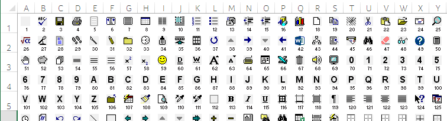

# Display FaceId images & numbers in Excel worksheet

Excel VBA macro to display built-in FaceId icons and numbers in a worksheet.



The [CommandBarButton.FaceId Property](https://msdn.microsoft.com/en-us/library/office/ff864154.aspx) is used to set the look (icon) of buttons used on a command bar (like the ribbon or a popup menu).

The repo includes a [PDF](faceid-number-1-to-20000.pdf) made with this macro showing the FaceId icons from number 1 to 20000.

## Installation

Clone or [download](../../archive/master.zip) the repository. You can also download the Excel file "faceid.xlsm" directly by right-clicking and selecting "save link as&hellip;".

## Usage

The macro "faceids_to_wks" is located inside the module "faceid" in the Excel file "faceid.xlsm".

Call the Sub **faceids_to_wks** with the following parameters:

| parameter      | type      | description                                        |
|:---------------|:----------|:---------------------------------------------------|
| wks            | Worksheet | The worksheet as object to display the FaceIds in  |
| str_first_cell | String    | Address of first cell to use as a string like "B2" |
| min_face_id    | Long      | Number of first FaceId to display                  |
| max_face_id    | Long      | Number of the last FaceId to display               |
| ids_per_row    | Long      | Number of IDs displayed per row                    |

Example call (included in the module "faceid"):

```vb
'example for calling the main sub and display FaceId 1 to 1000 in the wks
'the output of this is already generated and visible in the worksheet "faceid"
Sub call_faceid()
    Call faceids_to_wks(ThisWorkbook.Worksheets("faceid"), "B2", 1, 1000, 25)
End Sub
```

Remark: The module gets automatically exported when saving the Excel file. To stop this behavior change the constant in the module "autoopen" to "False":
```vba
Private Const is_in_development As Boolean = False
```

## Contributing

If you find a bug, please create a new issue. Pull requests are also welcome.

## Contributors

- [Daniel Hubmann](https://github.com/hubisan) (Author)

## License

Copyright (c) 2016 Daniel Hubmann. Licensed under [MIT](LICENSE).
